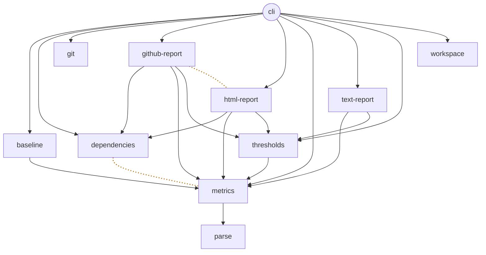

<!-- Generated by bb sample-report. -->

## Assay: assay

11 bricks, 0 errors, 40 warnings.

### Violations

| Metric | Errors | Warnings |
| --- | --- | --- |
| 🟦 Co-change | 0 | 2 |
| 🟪 Deep functions | 0 | 28 |
| 🟪 Long functions | 0 | 8 |
| 🟪 Many-parameter functions | 0 | 2 |
| 🟩 Main-sequence distance | 0 | 2 |
| 🟩 Duplicated forms | 0 | 1 |
| 🟩 Merge into | 0 | 1 |
| 🟫 Spread libraries | 0 | 1 |
| 🟧 Untyped errors | 0 | 1 |
| ⬜ Assertions per test | 0 | 1 |

### 🟦 Dependencies

Red: an unstable dependency, on a brick less stable by more than the threshold. Dashed: new since the base. Dotted amber, no arrow: bricks that change together but don't depend on each other.

| Brick | Afferent (Ca) | Efferent (Ce) | Instability | Unstable dependencies | Positional interface | Co-change |
| --- | --- | --- | --- | --- | --- | --- |
| base cli | 0 | 9 | 1.00 | 0 | – | 0 |
| component baseline | 1 | 1 | 0.50 | 0 | 0 | 0 |
| component dependencies | 3 | 0 | 0.00 | 0 | 0 | **1** ⚠️ |
| component git | 1 | 0 | 0.00 | 0 | 0 | 0 |
| component github-report | 1 | 3 | 0.75 | 0 | 0 | **1** ⚠️ |
| component html-report | 1 | 3 | 0.75 | 0 | 0 | 0 |
| component metrics | 6 | 1 | 0.14 | 0 | 0 | 0 |
| component parse | 1 | 0 | 0.00 | 0 | 0 | 0 |
| component text-report | 1 | 2 | 0.67 | 0 | 0 | 0 |
| component thresholds | 4 | 1 | 0.20 | 0 | 0 | 0 |
| component workspace | 1 | 0 | 0.00 | 0 | 0 | 0 |
| **Average** | 2 | 1.8 | 0.30 | 0 | 0 | 0.2 |

What these metrics mean

| Metric | Meaning |
| --- | --- |
| Afferent (Ca) | How many bricks depend on this brick's interface. A high count means a change here ripples widely, so the interface should change rarely. |
| Efferent (Ce) | How many interfaces this brick depends on. A high count means this brick is exposed to changes in many others. |
| Instability | `Ce / (Ca + Ce)`, from `0` (stable: others depend on it and it depends on little) to `1` (unstable: free to change, since nothing depends on it). Bricks should depend only on more stable bricks. |
| Unstable dependencies | Dependencies on a brick less stable than this one: its instability is higher than this brick's by more than the limit. Bricks should depend only on more stable bricks, so that what changes often doesn't ripple into what is meant to change rarely. A small gap is noise, so only a gap past the limit counts. **Threshold:** error > 0.1. |
| Positional interface | Interface functions that other bricks call with more positional parameters than the limit: connascence of position. Every caller depends on the order of the arguments; a map of named options doesn't. **Threshold:** warning > 4. |
| Co-change | Bricks that keep changing in the same commits but don't depend on each other: coupling the source doesn't show. Counted over the Git history of `:since`, in pairs that share at least `:min-shared` commits, leaving out commits that touch more than `:max-bricks-per-commit` bricks. The value is the share of this brick's commits that also change the other. **Threshold:** warning > 0.5. |

Co-change: 2 warnings

| Level | Brick | Detail | Location |
| --- | --- | --- | --- |
| ⚠️ warning | component github-report | with html-report in 16 of its 17 commits (94%), though neither depends on the other (above the maximum of 0.5) |  |
| ⚠️ warning | component dependencies | with metrics in 7 of its 10 commits (70%), though neither depends on the other (above the maximum of 0.5) |  |

### 🟪 Complexity

| Brick | Forms | Functions | Mean function complexity | Mean nesting depth | Complex functions | Deep functions | Long functions | Many-parameter functions |
| --- | --- | --- | --- | --- | --- | --- | --- | --- |
| base cli | 961 | 21 | 2.3 | 4.8 | 0 | 0 | 0 | 0 |
| component baseline | 465 | 11 | 2.2 | 4.6 | 0 | 0 | 0 | 0 |
| component dependencies | 3779 | 52 | 2.6 | 5.9 | 0 | **6** ⚠️ | **3** ⚠️ | **1** ⚠️ |
| component git | 313 | 11 | 1.1 | 3.5 | 0 | 0 | 0 | 0 |
| component github-report | 2048 | 41 | 2.9 | 5.6 | 0 | **5** ⚠️ | **1** ⚠️ | 0 |
| component html-report | 3174 | 61 | 2.6 | 6.2 | 0 | **8** ⚠️ | **1** ⚠️ | **1** ⚠️ |
| component metrics | 4568 | 81 | 2.3 | 5.2 | 0 | **4** ⚠️ | **1** ⚠️ | 0 |
| component parse | 635 | 22 | 2.1 | 4.1 | 0 | 0 | 0 | 0 |
| component text-report | 367 | 10 | 2.0 | 4.7 | 0 | 0 | 0 | 0 |
| component thresholds | 2255 | 47 | 2.4 | 5.1 | 0 | **5** ⚠️ | **2** ⚠️ | 0 |
| component workspace | 242 | 8 | 1.4 | 3.8 | 0 | 0 | 0 | 0 |
| **Average** | 1709.7 | 33.2 | 2.2 | 4.9 | 0 | 2.5 | 0.7 | 0.2 |

What these metrics mean

| Metric | Meaning |
| --- | --- |
| Forms | Every form at any depth: collections, symbols, and literals. A measure of size that ignores formatting and comments. |
| Functions | `defn`, `defn-`, `defmacro`, and `defmethod` definitions. |
| Mean function complexity | The mean cyclomatic complexity of the brick's functions. A rising mean means the brick as a whole is getting harder to follow. Complex functions counts the most complex. Bricks with fewer than 5 functions aren't compared: a mean of so few says little. |
| Mean nesting depth | The mean nesting depth of the brick's functions. See deep functions. Bricks with fewer than 5 functions aren't compared. |
| Complex functions | Functions whose cyclomatic complexity is above the limit: `1` plus a decision point for each `if`, `when`, `cond` clause, `and` and `or` argument, `catch`, and the like. **Threshold:** error > 10. |
| Deep functions | Functions nested deeper than the limit. Each collection inside another adds a level; a binding form's bindings start again at 1, and reader macros such as `@` and `'` add nothing. **Threshold:** warning > 8. |
| Long functions | Functions of more forms than the limit, counting every form in them. **Threshold:** warning > 150. |
| Many-parameter functions | Functions with more positional parameters than the limit, in their longest arity, not counting `&` rest parameters. **Threshold:** warning > 4. |

Functions: 31 warnings

| Level | Brick | Detail | Location |
| --- | --- | --- | --- |
| ⚠️ warning | component html-report | `section-table`: depth 12 > 8 (line 587), forms 283 > 150, params 5 > 4 | `components/html-report/src/systems/thoughtfull/assay/html_report/core.clj:555` |
| ⚠️ warning | component github-report | `section-table`: depth 12 > 8 (line 373), forms 256 > 150 | `components/github-report/src/systems/thoughtfull/assay/github_report/core.clj:341` |
| ⚠️ warning | component metrics | `private?`: depth 12 > 8 (line 899) | `components/metrics/src/systems/thoughtfull/assay/metrics/core.clj:888` |
| ⚠️ warning | component metrics | `interop?`: depth 12 > 8 (line 1053) | `components/metrics/src/systems/thoughtfull/assay/metrics/core.clj:1038` |
| ⚠️ warning | component dependencies | `analyze`: depth 11 > 8 (line 49) | `components/dependencies/src/systems/thoughtfull/assay/dependencies/errors.clj:30` |
| ⚠️ warning | component dependencies | `analyze`: depth 11 > 8 (line 40) | `components/dependencies/src/systems/thoughtfull/assay/dependencies/tests.clj:22` |
| ⚠️ warning | component metrics | `measure-test-source`: depth 11 > 8 (line 1174) | `components/metrics/src/systems/thoughtfull/assay/metrics/core.clj:1156` |
| ⚠️ warning | component thresholds | `std-devs-result`: depth 11 > 8 (line 172), forms 155 > 150 | `components/thresholds/src/systems/thoughtfull/assay/thresholds/core.clj:157` |
| ⚠️ warning | component dependencies | `analyze`: forms 202 > 150 | `components/dependencies/src/systems/thoughtfull/assay/dependencies/libraries.clj:82` |
| ⚠️ warning | component metrics | `measure-brick`: depth 10 > 8 (line 1214), forms 192 > 150 | `components/metrics/src/systems/thoughtfull/assay/metrics/core.clj:1193` |
| ⚠️ warning | component dependencies | `mermaid`: depth 9 > 8 (line 274), forms 191 > 150 | `components/dependencies/src/systems/thoughtfull/assay/dependencies/core.clj:260` |
| ⚠️ warning | component dependencies | `duplicates`: depth 10 > 8 (line 89) | `components/dependencies/src/systems/thoughtfull/assay/dependencies/connascence.clj:70` |
| ⚠️ warning | component dependencies | `analyze`: depth 10 > 8 (line 87), forms 180 > 150 | `components/dependencies/src/systems/thoughtfull/assay/dependencies/core.clj:60` |
| ⚠️ warning | component dependencies | `dependency-metrics`: params 5 > 4 | `components/dependencies/src/systems/thoughtfull/assay/dependencies/core.clj:46` |
| ⚠️ warning | component html-report | `table`: depth 10 > 8 (line 213) | `components/html-report/src/systems/thoughtfull/assay/html_report/core.clj:202` |
| ⚠️ warning | component html-report | `metric-headers`: depth 10 > 8 (line 222) | `components/html-report/src/systems/thoughtfull/assay/html_report/core.clj:215` |
| ⚠️ warning | component html-report | `legend`: depth 10 > 8 (line 627) | `components/html-report/src/systems/thoughtfull/assay/html_report/core.clj:617` |
| ⚠️ warning | component thresholds | `counts`: depth 10 > 8 (line 302) | `components/thresholds/src/systems/thoughtfull/assay/thresholds/core.clj:282` |
| ⚠️ warning | component thresholds | `worst-first`: depth 10 > 8 (line 401) | `components/thresholds/src/systems/thoughtfull/assay/thresholds/core.clj:396` |
| ⚠️ warning | component dependencies | `analyze`: depth 9 > 8 (line 73) | `components/dependencies/src/systems/thoughtfull/assay/dependencies/cohesion.clj:53` |

11 more

| Level | Brick | Detail | Location |
| --- | --- | --- | --- |
| ⚠️ warning | component github-report | `level-counts`: depth 9 > 8 (line 249) | `components/github-report/src/systems/thoughtfull/assay/github_report/core.clj:245` |
| ⚠️ warning | component github-report | `legend`: depth 9 > 8 (line 299) | `components/github-report/src/systems/thoughtfull/assay/github_report/core.clj:290` |
| ⚠️ warning | component github-report | `shown-bricks`: depth 9 > 8 (line 327) | `components/github-report/src/systems/thoughtfull/assay/github_report/core.clj:319` |
| ⚠️ warning | component github-report | `shared-libraries-table`: depth 9 > 8 (line 421) | `components/github-report/src/systems/thoughtfull/assay/github_report/core.clj:412` |
| ⚠️ warning | component html-report | `level-counts`: depth 9 > 8 (line 360) | `components/html-report/src/systems/thoughtfull/assay/html_report/core.clj:354` |
| ⚠️ warning | component html-report | `metric-link`: depth 9 > 8 (line 408) | `components/html-report/src/systems/thoughtfull/assay/html_report/core.clj:404` |
| ⚠️ warning | component html-report | `shown-bricks`: depth 9 > 8 (line 550) | `components/html-report/src/systems/thoughtfull/assay/html_report/core.clj:542` |
| ⚠️ warning | component html-report | `shared-libraries-table`: depth 9 > 8 (line 783) | `components/html-report/src/systems/thoughtfull/assay/html_report/core.clj:771` |
| ⚠️ warning | component thresholds | `merge-config`: depth 9 > 8 (line 104) | `components/thresholds/src/systems/thoughtfull/assay/thresholds/core.clj:97` |
| ⚠️ warning | component thresholds | `violations :count`: depth 9 > 8 (line 265) | `components/thresholds/src/systems/thoughtfull/assay/thresholds/core.clj:249` |
| ⚠️ warning | component thresholds | `check-settings`: forms 154 > 150 | `components/thresholds/src/systems/thoughtfull/assay/thresholds/core.clj:48` |

### 🟩 Modularity

| Brick | Abstractness | Main-sequence distance | Cohesion | Shared keywords | Duplicated forms | Merge into |
| --- | --- | --- | --- | --- | --- | --- |
| base cli | – | – | – | 0 | 0 | – |
| component baseline | 0.82 | 0.32 | 0.87 | 0 | 0 | – |
| component dependencies | 0.93 | 0.07 | 1.00 | 0 | 0 | – |
| component git | 0.64 | 0.36 | 1.00 | 0 | 0 | – |
| component github-report | 0.95 | **0.70** ⚠️ | 0.70 | 0 | **49** ⚠️ | – |
| component html-report | 0.98 | **0.73** ⚠️ | 0.74 | 0 | **49** ⚠️ | – |
| component metrics | 0.82 | 0.03 | 0.76 | 0 | 0 | – |
| component parse | 0.70 | 0.30 | 1.00 | 0 | 0 | **metrics (14%)** ⚠️ |
| component text-report | 0.90 | 0.57 | 0.71 | 0 | 0 | – |
| component thresholds | 0.81 | 0.01 | 0.86 | 0 | 0 | – |
| component workspace | 0.78 | 0.22 | 1.00 | 0 | 0 | – |
| **Average** | 0.83 | 0.33 | 0.86 | 0 | 8.9 | 14% |

What these metrics mean

| Metric | Meaning |
| --- | --- |
| Abstractness | `1 - public interface definitions / all definitions`, counting `def`, `defn`, `defmethod`, and the like. A small interface over a large implementation scores near `1`. Private definitions in an interface namespace aren't interface. Bases have no interface, so no abstractness. Main-sequence distance weighs it against instability. |
| Main-sequence distance | `\|abstractness + instability - 1\|`. A stable component (low instability) should be abstract, hiding its implementation behind a small interface, and an unstable one needn't be. Near `0` is balanced. Near `1` is either stable and concrete, hard to change though much depends on it, or abstract and unstable, an interface little uses. **Threshold:** warning > 0.7. |
| Cohesion | `own references / workspace references`: how much the component's code refers to its own namespaces rather than to other bricks. References to libraries don't count. A low value means the component is mostly glue between other bricks. Bases are glue by design, so they have none. Components with fewer than 10 workspace references aren't checked: there is too little to go on. **Threshold:** warning < 0.5. |
| Shared keywords | Qualified keywords this brick uses that another brick also uses, such as `:patient/id`: map keys and values that both must agree on (connascence of meaning). Renaming one means changing every brick that shares it. Unqualified keywords, such as `:id` or HoneySQL's `:select`, are too generic to say which bricks agree on what. |
| Duplicated forms | Forms of code that appears in another brick too, in duplicates of more forms than the limit, compared after formatting and comments: connascence of algorithm. A fix to one copy has to be made to the other. **Threshold:** warning > 30. |
| Merge into | For a component used by a single component: that component, and this one's size as a share of its forms. A component that small, with one user, may belong inside it. Below the limit, it's flagged. **Threshold:** warning < 0.25. |

Main-sequence distance: 2 warnings

| Level | Brick | Detail | Location |
| --- | --- | --- | --- |
| ⚠️ warning | component html-report | 0.73 is above the maximum of 0.7 |  |
| ⚠️ warning | component github-report | 0.7 is above the maximum of 0.7 |  |

Duplicated forms: 1 warning

| Level | Brick | Detail | Location |
| --- | --- | --- | --- |
| ⚠️ warning | component github-report | 49 forms in each of github-report, html-report, the same code (more than 30) | `components/github-report/src/systems/thoughtfull/assay/github_report/core.clj:247` `components/html-report/src/systems/thoughtfull/assay/html_report/core.clj:357` |

Merge into: 1 warning

| Level | Brick | Detail | Location |
| --- | --- | --- | --- |
| ⚠️ warning | component parse | is used only by metrics, and has 14% as many forms; consider merging it into metrics (below the minimum of 0.25) |  |

### 🟫 I/O and mutability

| Brick | Libraries | Spread libraries | Interop density | Mutable state |
| --- | --- | --- | --- | --- |
| base cli | 2 | **1** ⚠️ | 1.0 | 0 |
| component baseline | 0 | 0 | 0.2 | 0 |
| component dependencies | 0 | 0 | 0.1 | 0 |
| component git | 1 | **1** ⚠️ | 3.5 | 0 |
| component github-report | 0 | 0 | 0.1 | 0 |
| component html-report | 0 | 0 | 0.1 | 0 |
| component metrics | 2 | **1** ⚠️ | 0.1 | 0 |
| component parse | 1 | 0 | 0.0 | 0 |
| component text-report | 0 | 0 | 0.0 | 0 |
| component thresholds | 0 | 0 | 0.3 | 0 |
| component workspace | 1 | **1** ⚠️ | **5.0** | 0 |
| **Average** | 0.6 | 0.4 | 0.9 | 0 |

Bold: 2 or more standard deviations worse than the mean of the other bricks the metric checks. Only ratios, densities, and means are outlined.

What these metrics mean

| Metric | Meaning |
| --- | --- |
| Libraries | Libraries outside the workspace that the brick requires, named by their namespaces, such as `next.jdbc` or `clojure.java.io`. Clojure's own pure namespaces, such as `clojure.string`, don't count. |
| Spread libraries | Libraries this brick requires that more bricks than the limit require. A library wrapped by one brick can be replaced or upgraded in one place; a library spread across bricks, such as a database driver, means a missing gateway component. Libraries in `:allow` don't count. **Threshold:** warning > 3. |
| Interop density | Host interop forms per 100 forms, so that large and small bricks compare fairly: Java or JavaScript method calls, field access, constructors, static members, and `js/` references. A component that wraps a host API is dense by design; interop scattered through domain logic isn't. **Threshold:** warning > 5. |
| Mutable state | Top-level `atom`, `ref`, `agent`, and `volatile!` definitions, `^:dynamic` vars, and `alter-var-root` calls: state hidden from the functions that depend on it, which makes tests interfere with each other. **Threshold:** warning > 0. |

**Shared libraries**

| Library | Bricks | Spread | Required by |
| --- | --- | --- | --- |
| `clojure.java.io` | 4 | ⚠️ warning | cli, git, metrics, workspace |
| `rewrite-clj` | 2 |  | metrics, parse |

### 🟧 Error handling

| Brick | Error surface | Untyped errors | Broad catches |
| --- | --- | --- | --- |
| base cli | – | 1 | 0 |
| component baseline | 0.00 | 0 | 0 |
| component dependencies | 0.00 | 0 | 0 |
| component git | **1.00** | **1** ⚠️ | 0 |
| component github-report | 0.00 | 0 | 0 |
| component html-report | 0.00 | 0 | 0 |
| component metrics | 0.00 | 0 | 0 |
| component parse | 0.00 | 0 | 0 |
| component text-report | 0.00 | 0 | 0 |
| component thresholds | 0.10 | 0 | 0 |
| component workspace | 0.00 | 0 | 0 |
| **Average** | 0.11 | 0.1 | 0 |

Bold: 2 or more standard deviations worse than the mean of the other bricks the metric checks. Only ratios, densities, and means are outlined.

What these metrics mean

| Metric | Meaning |
| --- | --- |
| Error surface | The share of a component's public interface definitions that can throw: their body contains `throw` or `throw+`, or refers to a definition that can, in this brick or another. Each is a failure every caller must be ready for; the fewer, the simpler the interface. Throws in libraries aren't seen. Bases have no interface. |
| Untyped errors | Throws that give callers nothing to tell failures apart by: a host exception such as `(Exception. msg)` or `(js/Error. msg)`, or `ex-info` whose data map has no `:type` key (or `:cognitect.anomalies/category`). Rethrows, and data that isn't a literal map, don't count. **Threshold:** warning > 0. |
| Broad catches | `catch` clauses for `Exception`, `RuntimeException`, `Throwable`, or `Object`, or ClojureScript's `:default`, `js/Error`, or `js/Object`, that log and carry on, or carry on silently. In a component, a broad catch decides for every caller what a failure means. A catch that rethrows, such as wrapping the failure in an `ex-info` of the component's own, doesn't count: that translates a failure rather than hiding it. **Threshold:** warning > 0. |

Untyped errors: 1 warning

| Level | Brick | Detail | Location |
| --- | --- | --- | --- |
| ⚠️ warning | component git | throws ex-info without a :type in its data | `components/git/src/systems/thoughtfull/assay/git/core.clj:14` |

### ⬜ Tests

| Brick | Tests | Assertions per test | Forms per test | Untested interface | Boundary crossings | Isolation hazards | Test ratio |
| --- | --- | --- | --- | --- | --- | --- | --- |
| base cli | 8 | 4.0 | 80.6 | – | 0 | 0 | 0.86 |
| component baseline | 6 | 1.7 | 92.8 | 0.00 | 0 | 0 | 1.32 |
| component dependencies | 22 | 2.7 | 104.8 | 0.00 | 0 | 0 | 0.83 |
| component git | 3 | 3.0 | 110.7 | 0.00 | 0 | 0 | 1.37 |
| component github-report | 17 | 2.6 | 50.8 | 0.00 | 0 | 0 | 0.51 |
| component html-report | 19 | 3.3 | 51.9 | 0.00 | 0 | 0 | 0.37 |
| component metrics | 24 | **4.1** ⚠️ | 84.5 | **0.42** | 0 | 0 | 0.46 |
| component parse | 6 | 2.2 | 56.2 | 0.14 | 0 | 0 | 0.56 |
| component text-report | 4 | 1.0 | 22.5 | 0.00 | 0 | 0 | 0.59 |
| component thresholds | 12 | 2.9 | 111.6 | 0.20 | 0 | 0 | 0.64 |
| component workspace | 2 | 1.5 | 69.5 | 0.00 | 0 | 0 | 0.71 |
| **Average** | 11.2 | 2.5 | 75.5 | 0.08 | 0 | 0 | 0.75 |

Bold: 2 or more standard deviations worse than the mean of the other bricks the metric checks. Only ratios, densities, and means are outlined.

What these metrics mean

| Metric | Meaning |
| --- | --- |
| Tests | `deftest` forms in the brick's `test` directory. |
| Assertions per test | The mean number of `is` and `are` assertions per `deftest`. A test with many assertions checks many things, so a failure says less about what broke. Bricks with fewer than 10 tests aren't compared. **Threshold:** warning > mean + 2σ. |
| Forms per test | The mean size of a `deftest`, in forms. Large tests usually set up a lot of state or check many behaviors at once. Bricks with fewer than 10 tests aren't compared. **Threshold:** warning > mean + 2σ. |
| Untested interface | The share of a component's public interface definitions that no test anywhere in the workspace mentions: API with no test at all. Components with fewer than 10 definitions aren't checked. Bases have no interface. **Threshold:** warning > 0.5. |
| Boundary crossings | Requires, in this brick's tests, of another brick's source namespaces other than its interface. Tests that reach into an implementation break when it changes, though its interface didn't. Another brick's test namespaces, such as shared generators, don't count. **Threshold:** warning > 0. |
| Isolation hazards | Things in tests that let tests affect each other or depend on timing: `with-redefs`, `Thread/sleep`, `alter-var-root`, and top-level atoms, refs, agents, volatiles, and dynamic vars. |
| Test ratio | Test forms per source form. A crude measure of how much testing a brick has; compare it with other bricks rather than aim for a number. |

Assertions per test: 1 warning

| Level | Brick | Detail | Location |
| --- | --- | --- | --- |
| ⚠️ warning | component metrics | 4.08 is 4.0 standard deviations above the mean of 4 other components (2.9 ± 0.3), over the limit of 2 |  |

